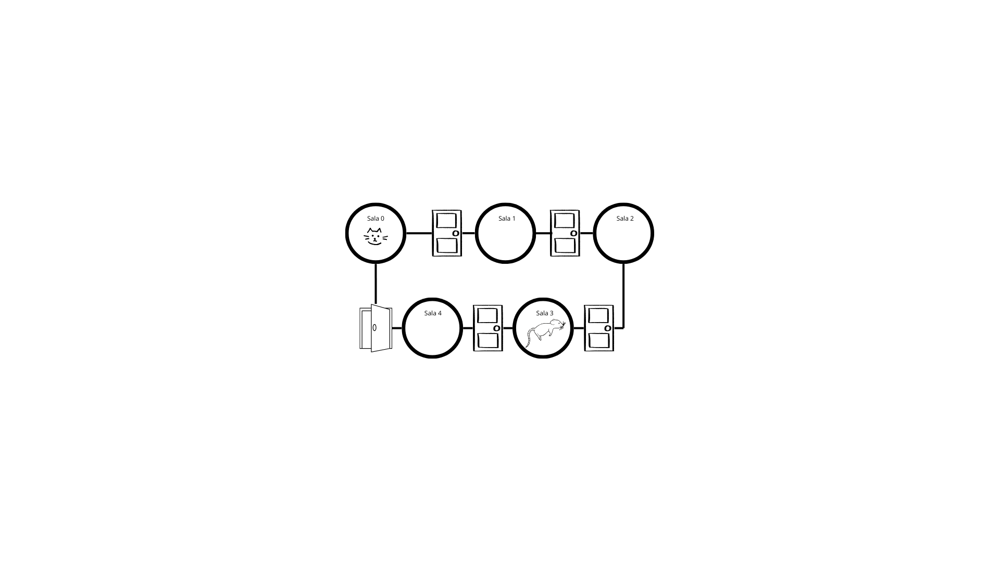
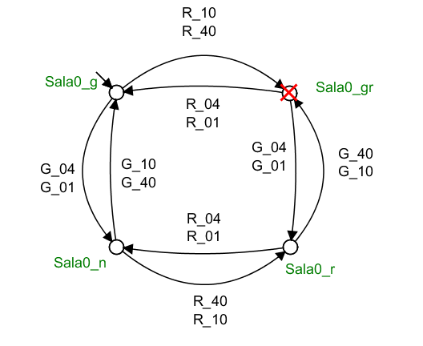

## Projeto da disciplina de Sistemas de Eventos Discretos 
Projeto realizado por: 
> Marcus Vinícius de Medeiros - 121110400

> William Santos Moreira - 121110532

> Ygor de Almeida Pereira - 121110166

## 🐈 Controle do fluxo de salas entre dois agentes (gato e rato) com auxílio de portas

Este projeto aborda a modelagem de um sistema clássico de eventos discretos, no qual um gato e um rato se deslocam livremente em uma torre composta por 5 salas organizadas em ciclo.

## 🔎 Descrição Geral

O objetivo é desenvolver um controlador automatizado capaz de restringir os movimentos do gato e do rato, assegurando a principal condição de segurança: eles nunca podem ocupar a mesma sala ao mesmo tempo.
O sistema supervisionado deve ser não bloqueante (isto é, nunca travar) e maximamente permissivo, garantindo a maior liberdade possível de deslocamento sem violar a regra de segurança.

## ⛔ Problema Encontrado

Na construção dos autômatos, surge uma limitação importante: a não controlabilidade dos movimentos do rato. Como ele pode se mover de forma totalmente autônoma, sem restrições externas, torna-se inviável controlar o sistema apenas com base em eventos observáveis.

Assim, embora o sistema seja observável, não é controlável. A incerteza sobre a direção escolhida pelo rato, somada à ausência de garantias sobre a realização efetiva das transições de movimento, gera uma dificuldade adicional na modelagem das especificações.

Diante dessa condição, duas abordagens podem ser consideradas para superar o problema.

## 🎯 Premissa

Ao introduzir portas de controle no sistema (limitadas a quatro), os deslocamentos do rato deixam de ser totalmente livres e passam a ser influenciados pelo estado das portas (abertas ou fechadas).
Com isso, os movimentos do rato tornam-se controláveis, eliminando os problemas de controlabilidade inicial. Dessa forma, é possível modelar o sistema de maneira permissiva, não bloqueante e plenamente controlável.

Portanto, podemos deduzir que o autômato do gato e do rato pode ser resumido, essencialmente, à construção dos autômatos do gato, do rato e das especificações do sistema, que simulam o comportamento das portas e determinam a controlabilidade dos eventos de movimento do rato.

## Esquemático do Sistema

 Figura 0: Esquemático

## ⚙️ Componentes do Sistema
O sistema em estudo é constituído por dois agentes, denominados Gato e Rato, cujos comportamentos foram modelados na forma de plantas. A regra de operação é definida por uma especificação de segurança, responsável por estabelecer as condições de controle. No entanto, devido à característica de não controlabilidade associada ao agente Rato, tornou-se necessária a introdução de portas entre as salas, de modo a viabilizar o cumprimento da especificação e garantir o correto funcionamento do sistema.

### 🐈 O Gato
O gato é um dos agentes do sistema, capaz de se mover para salas adjacentes. Seus movimentos são considerados eventos controláveis, o que significa que o supervisor pode optar por mover-se ou não quando necessário.

#### Estados
- **S0** (Inicial), **S1**, **S2**, **S3**, **S4**: Representa os estados que o gato está posicionado, em que S0 está relacionado à Sala1, S1 à Sala2, e assim por diante.

#### Eventos
- **G_01**, **G_10**, **G_12**, **G_21**, **G_23**, **G_32**, **G_34**, **G_43**, **G_40**, **G_04**: Eventos controláveis que representam o movimento do gato.

 Figura 01: Eventos do autômato do Gato

#### Planta: Autômato do Gato

 Figura 02: Autômato do Gato

### 🐁 O Rato
O rato é o segundo agente do sistema. Ele também se move livremente entre as salas, mas seus movimentos são não **controláveis**. Isso significa que eles ocorrem espontaneamente e o supervisor não pode impedi-los; ele deve antecipá-los.

#### Estados
- **S0**, **S1**, **S2** (Inicial), **S3**, **S4**: Representa os estados que o gato está posicionado, em que S0 está relacionado à Sala1, S1 à Sala2, e assim por diante.

#### Eventos 
- **R_01**, **R_10**, **R_12**, **R_21**, **R_23**, **R_32**, **R_34**, **R_43**, **R_40**, **R_04**: Eventos controláveis e não controláveis que representam o movimento do rato.

 Figura 03: Eventos do autômato do Rato

#### ⚠️ Observação: Mudança na interpretação
Podemos observar que os movimentos do rato, antes totalmente não controláveis, tornaram-se em grande parte controláveis devido à inserção das portas entre as salas. No entanto, os movimentos do rato entre as salas 4 e 0 permanecem não controláveis, em razão da limitação de utilização de apenas quatro portas.

#### Planta: Autômato do Rato

 Figura 04: Autômato do Rato

## ⚙️ Modelagem das Salas
Além dos autômatos que modelam os agentes Gato e Rato, faz-se necessária a inclusão de especificações que representem o funcionamento das portas entre as salas da forma desejada pelo controle. Esses autômatos têm como finalidade viabilizar o controle dos movimentos dos agentes no sistema, atuando como elementos de restrição e coordenação, de modo a garantir que a especificação de segurança seja satisfeita.

## 🛑 Especificações
Este autômato tem como função assegurar que o Gato e o Rato nunca ocupem a mesma sala simultaneamente. Para atender a esse objetivo, torna-se necessário o desenvolvimento de autômatos adicionais que imponham restrições sobre determinados movimentos (eventos), de modo que o sistema resultante opere conforme o comportamento esperado.

As especificações foram definidas com base na quantidade de agentes presentes em cada sala, considerando que os estados em que gato e rato estivessem juntos deveriam ser bloqueados.

### 🕹️ Especifição: Sala 0

#### Estados
- **Sala0_g** (Inicial): Indica que apenas o gato está na sala.
- **Sala0_n**: Indica que ningúem está na sala.
- **Sala0_r**: Indica que apenas o rato está na sala.
- **Sala0_gr**: Indica que o gato e o rato estão na sala

#### Planta: Autômato do Sala 0

 Figura 05: Autômato da Sala 0

...
#### ⚠️ Observação: Temos um comportamento similar para as outras salas (Sala 1, Sala 2, Sala 3 e Sala 4)
...

### 🧩 Autômato Resultante (Após a Síntese dos autômatos)

Realizando-se a composição paralela, temos o autômato resultante da síntese supervisionada dos autômatos *Gato*, *Rato*, e as *Especificações*. 
O sistema resultante apresenta as seguintes propriedades:

- Permite que o Gato e o Rato se movimentem de forma controlada, garantindo as especificações do projeto.

- Assegura que, em nenhum momento, os dois agentes ocupem a mesma sala;

- É não bloqueante, ou seja, não existem estados em que todos os movimentos possíveis dos agentes sejam impedidos;

- É maximamente permissivo dentro das restrições de segurança impostas.

Com essa composição, o autômato resultante da síntese é capaz de localizar as posições de ambos os agentes e permitir seus deslocamentos de maneira aleatória e/ou simultânea. Entretanto, apenas movimentos seguros são autorizados, de modo que o Gato e o Rato nunca compartilhem a mesma sala em nenhum instante da execução do sistema.

### 🧩 Considerações

Foi necessária uma reinterpretação do problema para tornar viável uma solução, já que a não controlabilidade dos movimentos do rato impedia a obtenção de uma síntese controlável. Com a inserção das portas, esse obstáculo foi contornado, permitindo a resolução do problema inicial.

### 🎥 Link do vídeo: https://youtu.be/e5iRtu5eMLY

### 🖊️ Documento: 
doc/
├─ Automato_GatoRato_ALTERNANDO.wmod (Modelagem com alternância - antiga)
├─ GatoRatoSED.wmod (Modelagem do Projeto Completa - Utilizando-se de variáveis)
└─ ProjetoSED.wmod (Modelagem do Projeto Completa - Utilizando-se as salas)

|- Imagens...

✉ README.md    [selected]

