## Projeto da disciplina de Sistemas de Eventos Discretos 
Projeto realizado por: 
> Marcus Vinícius de Medeiros - 121110400

> William Santos Moreira - 121110532

> Ygor de Almeida Pereira - 121110166

# 🐈 Controle do fluxo de salas entre dois agentes (gato e o rato) com auxílio de portas
Este projeto modela um sistema clássico de eventos discretos envolvendo um gato e um rato que se movem livremente em uma torre com 5 salas dispostas em um ciclo. 

## 🔎 Descrição Geral
Este projeto modela um sistema clássico de eventos discretos envolvendo um gato e um rato que se movem livremente em uma torre com 5 salas dispostas em um ciclo. O objetivo é desenvolver um supervisor (um controlador automatizado) que restrinja os movimentos do gato para garantir a principal condição de segurança: o gato nunca deve ocupar a mesma sala que o rato. O sistema supervisionado deve ser não-bloqueante (nunca travar) e maximamente permissivo, concedendo a maior liberdade de movimento possível sem violar a regra de segurança.

## ⛔ Problema Extra
Durante a montagem dos autômatos, observa-se a existência de uma restrição que não é imediatamente aparente, mas que se torna evidente quando se busca efetivamente controlar o sistema. Ao modelar as especificações, em especial os eventos bloqueantes, verifica-se que a ausência de controle sobre os movimentos dos ratos impõe uma dificuldade adicional à modelagem. Isso ocorre porque, embora o sistema seja observável, ele não é controlável. Além da incerteza quanto à direção escolhida pelo rato em seus deslocamentos, não há garantia nem controle sobre a efetiva realização da transição correspondente ao movimento.

## ⚙️ Componentes do Sistema
O sistema em estudo é constituído por dois agentes, denominados Gato e Rato, cujos comportamentos foram modelados na forma de plantas. A regra de operação é definida por uma especificação de segurança, responsável por estabelecer as condições de controle. No entanto, devido à característica de não controlabilidade associada ao agente Rato, tornou-se necessária a introdução de portas entre as salas, de modo a viabilizar o cumprimento da especificação e garantir o correto funcionamento do sistema.

### 🐈 O Gato
O gato é um dos agentes do sistema, capaz de se mover para salas adjacentes. Seus movimentos são considerados eventos controláveis, o que significa que o supervisor pode optar por mover-se ou não quando necessário.

#### Estados
- **S0** (Inicial), **S1**, **S2**, **S3**, **S4**: Representa os estados que o gato está posicionado, em que S0 está relacionado à Sala1, S1 à Sala2, e assim por diante.

#### Eventos
- **G_01**, **G_10**, **G_12**, **G_21**, **G_23**, **G_32**, **G_34**, **G_43**, **G_40**, **G_04**: Eventos controláveis que representam o movimento do gato.

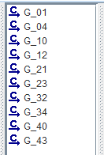

 Figura 01: Eventos do autômato do Gato

#### Planta: Autômato do Gato

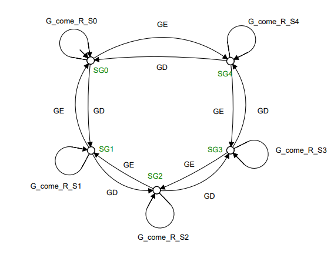

 Figura 02: Autômato do Gato

### 🐁 O Rato
O rato é o segundo agente do sistema. Ele também se move livremente entre as salas, mas seus movimentos são não **controláveis**. Isso significa que eles ocorrem espontaneamente e o supervisor não pode impedi-los; ele deve antecipá-los.

#### Estados
- **S0**, **S1**, **S2** (Inicial), **S3**, **S4**: Representa os estados que o gato está posicionado, em que S0 está relacionado à Sala1, S1 à Sala2, e assim por diante.

#### Eventos 
- **R_01**, **R_10**, **R_12**, **R_21**, **R_23**, **R_32**, **R_34**, **R_43**, **R_40**, **R_04**: Eventos não controláveis que representam o movimento do rato.

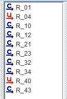

 Figura 03: Eventos do autômato do Rato

#### Planta: Autômato do Rato

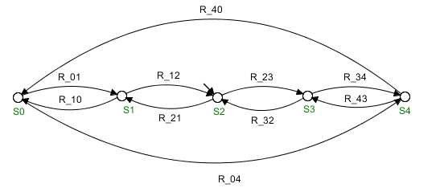

 Figura 04: Autômato do Gato

## ⚙️ Modelagem das Portas
Além dos autômatos que modelam os agentes Gato e Rato, faz-se necessária a inclusão de plantas adicionais que representem o funcionamento das portas entre as salas. Essas plantas têm como finalidade viabilizar o controle dos movimentos dos agentes no sistema, atuando como elementos de restrição e coordenação, de modo a garantir que a especificação de segurança seja satisfeita.

Esses autômatos tem como objetivo representarem o funcionamento das portas entre as salas, modelando duas ações possíveis: abrir ou fechar a porta.

### 🕹️ Porta 1 (Entre as salas 1 e 2)

#### Estados
- **P01** (Inicial): Indica que a porta está aberta.
- **P01_F**: Indica que a porta está fechada.

#### Eventos Próprios
- **P01_Abrir**: Ação para abrir a porta.
- **P01_Fechar**: Transição para fechar a porta.

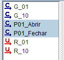

 Figura 05: Eventos do autômato da Porta_01

#### Planta: Autômato do Porta_01

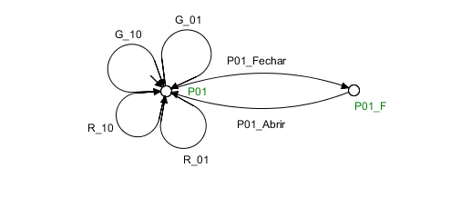

 Figura 06: Autômato da Porta_01

### 🕹️ Porta 2 (Entre as salas 2 e 3)

#### Estados
- **P12** (Inicial): Indica que a porta está aberta.
- **P12_F**: Indica que a porta está fechada.

#### Eventos Próprios
- **P12_Abrir**: Ação para abrir a porta.
- **P12_Fechar**: Transição para fechar a porta.

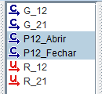

 Figura 07: Eventos do autômato da Porta_12

#### Planta: Autômato do Porta_12

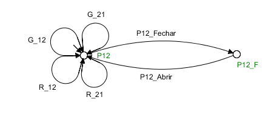

 Figura 08: Autômato da Porta_12

### 🕹️ Porta 3 (Entre as salas 3 e 4)

#### Estados
- **P23** (Inicial): Indica que a porta está aberta.
- **P23_F**: Indica que a porta está fechada.

#### Eventos Próprios
- **P23_Abrir**: Ação para abrir a porta.
- **P23_Fechar**: Transição para fechar a porta.

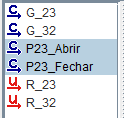

 Figura 09: Eventos do autômato da Porta_23

#### Planta: Autômato do Porta_23

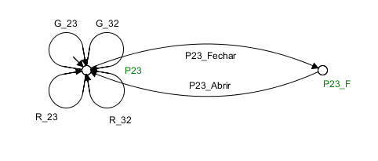

 Figura 10: Autômato da Porta_23

### 🕹️ Porta 4 (Entre as salas 4 e 5)

#### Estados
- **P34** (Inicial): Indica que a porta está aberta.
- **P34_F**: Indica que a porta está fechada.

#### Eventos Próprios
- **P34_Abrir**: Ação para abrir a porta.
- **P34_Fechar**: Transição para fechar a porta.

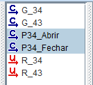

 Figura 11: Eventos do autômato da Porta_34

#### Planta: Autômato do Porta_34

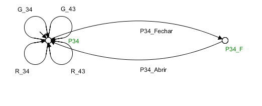

 Figura 12: Autômato da Porta_34

## 🛑 Especificações
Este autômato tem como função assegurar que o Gato e o Rato nunca ocupem a mesma sala simultaneamente. Para atender a esse objetivo, torna-se necessário o desenvolvimento de autômatos adicionais que imponham restrições sobre determinados movimentos (eventos), de modo que o sistema resultante opere conforme o comportamento esperado.

Foram elaboradas duas especificações para a modelagem do sistema. A primeira corresponde ao resultado da composição paralela dos autômatos que representam o Gato e o Rato, enquanto a segunda refere-se à composição das portas entre as salas. A partir desses autômatos resultantes, foram então aplicadas as restrições necessárias para garantir o atendimento à especificação de segurança do sistema.

### 🎌 Especificação: Gato e Rato

Inicialmente, após a geração da especificação por meio da composição entre as plantas que representam os agentes do sistema, foram aplicadas as restrições necessárias. Em essência, essas restrições correspondem aos estados em que o Gato e o Rato ocupam simultaneamente a mesma sala, situação que deve ser evitada no modelo.

#### Especificação: Autômato do Gato||Rato

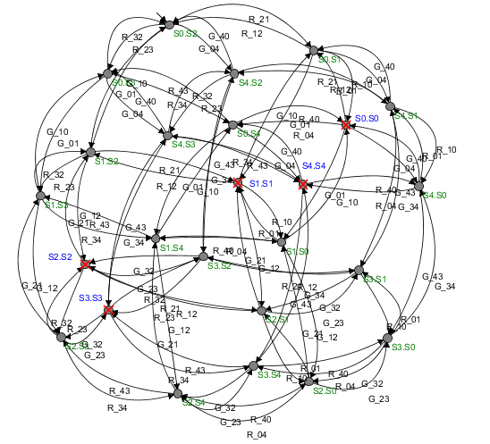

 Figura 13: Especificação GATO||RATO

**Observação:** Observa-se que o modelo apresenta estados com restrição, destacados em azul, enquanto os outros permanecem representados na cor verde.

### 🎌 Especificação: Autômato da Composição das Portas

**Objetivo:** O objetivo é representar de forma completa as condições em que as portas devem permanecer abertas ou fechadas, considerando os possíveis movimentos do Gato e do Rato, de modo a garantir que cada transição dos agentes resulte na configuração correta de acesso entre as salas. Por se tratar de uma especificação, os eventos que violam essas condições devem ser bloqueados. Como o autômato das portas define que os movimentos de entrada em uma sala dependem do estado atual das portas, surgem restrições automáticas no sistema. Dessa forma, após a composição de todos os autômatos, obtém-se uma especificação completa que descreve todos os movimentos permitidos para os agentes, assegurando a operação correta e segura do sistema.

### 🧩 Autômato Resultante (Após a Síntese dos autômatos)

Realizando-se a composição paralela, temos o autômato resultante da síntese supervisionada dos autômatos *Gato*, *Rato*, e das **Portas* e as *Especificações* será um sistema que:

- Permitirá que o Gato e o Rato se simuntaneamente, uma interpretação rigorosa do sistema.

- Garantirá que em nenhum momento o Gato e o Rato ocupem a mesma sala.

- Será não-bloqueante, ou seja, não há um estado em que haja o bloqueio dos movimentos do gato e do gato por completo.

- Será maximamente permissivo dentro das restrições de segurança e da alternância de turnos.

Com a composição desses autômatos, o autômato resultante da síntese é capaz de identificar as posições dos agentes (Gato e Rato) e de permitir seus movimentos de forma aleatória e/ou simultânea. Apenas movimentos seguros são autorizados, garantindo que os dois agentes nunca ocupem a mesma sala simultaneamente.

### 🧩 Considerações

A condição que garante a simultaneidade dos movimentos dos agentes impõe limitações às possibilidades de deslocamento, de modo que o Gato e o Rato não podem ocupar salas adjacentes ao mesmo tempo. Caso essa restrição não fosse necessária, seria possível permitir uma maior flexibilidade nos movimentos dos agentes entre as salas, ampliando as combinações de estados possíveis no sistema.

