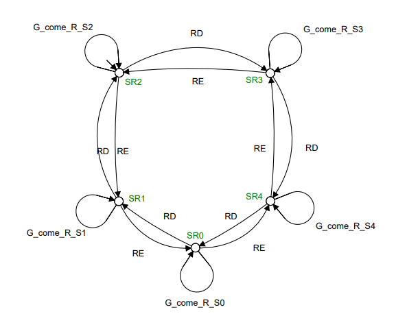
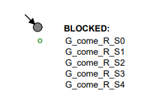
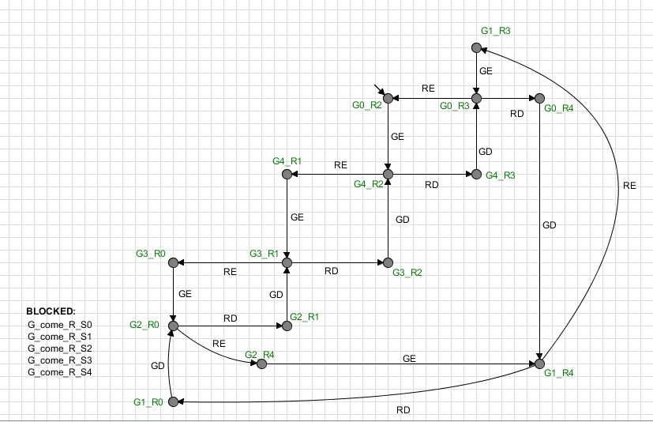

## Projeto da disciplina de Sistemas de Eventos Discretos 
Projeto realizado por: 
> Marcus Vinícius de Medeiros - 121110400

> William Santos Moreira - 121110532

> Ygor de Almeida Pereira - 121110166

# 🐈 Controle do fluxo de salas entre dois agentes (gato e o rato)
Este projeto modela um sistema clássico de eventos discretos envolvendo um gato e um rato que se movem livremente em uma torre com 5 salas dispostas em um ciclo. 

## 🔎 Descrição Geral
Este projeto modela um sistema clássico de eventos discretos envolvendo um gato e um rato que se movem livremente em uma torre com 5 salas dispostas em um ciclo. O objetivo é desenvolver um supervisor (um controlador automatizado) que restrinja os movimentos do gato para garantir a principal condição de segurança: o gato nunca deve ocupar a mesma sala que o rato. O sistema supervisionado deve ser não-bloqueante (nunca travar) e maximamente permissivo, concedendo a maior liberdade de movimento possível sem violar a regra de segurança.

## ⚙️ Componentes do Sistema
O sistema é composto por dois agentes (o Gato e o Rato), cujos comportamentos são modelados como plantas, e uma especificação de segurança que define a regra de controle.

### 🐈 O Gato
O gato é um dos agentes do sistema, capaz de se mover para salas adjacentes. Seus movimentos são considerados eventos controláveis, o que significa que o supervisor pode optar por desabilitá-los temporariamente para garantir a segurança.

#### Estados
- **SG0** (Inicial), **SG1**, **SG2**, **SG3**, **SG4**: Representa os estados que o gato está posicionado, em que SG0 está relacionado à Sala1, SG1 à Sala1, e assim por diante.

#### Eventos
- **GD**, **GE**: Eventos controláveis que representam o movimento do gato.

#### Eventos para implementações de restrições
- **G_come_R_S0**, **G_come_R_S1**, **G_come_R_S2**, **G_come_R_S3**, **G_come_R_S4**: Eventos não controláveis que serão utilizados para detecção de colisões 

 Figura 01: Autômato do Gato

### 🐁 O Rato
O rato é o segundo agente do sistema. Ele também se move livremente entre as salas, mas seus movimentos são não **controláveis**. Isso significa que eles ocorrem espontaneamente e o supervisor não pode impedi-los; ele deve antecipá-los.

#### Estados
- **SR0**, **SR1**, **SR2**, **SR3** (Inicial), **SR4**: Representa os estados que o gato está posicionado, em que SR0 está relacionado à Sala1, SR1 à Sala1, e assim por diante.

#### Eventos 
- **RD**, **RE**: Eventos não controláveis que representam o movimento do rato.

#### Eventos para implementações de restrições
- **G_come_R_S0**, **G_come_R_S1**, **G_come_R_S2**, **G_come_R_S3**, **G_come_R_S4**: Eventos não controláveis que serão utilizados para detecção de colisões 

 Figura 02: Autômato do Rato

## ⚙️ Componentes do Sistema (Complemento)
Além dos autômatos do Gato e do Rato, visando implementar o controle de "um passo por vez" e um autômato para limitações de colisões, adicionaremos mais dois autômatos: o *Gato_Rato* e o *Limites*.

### 🕹️ Gato_Rato (Controle de passo)
Este autômato será responsável por garantir que o Gato e o Rato se movam alternadamente. Ele atuará como um "semafáro", permitindo que apenas um dos agentes se mova por vez, e que necessariamente após a movimentação de um, o próximo movimento deve ser do outro.

#### Estados
- **Gato** (Inicial): Indica que é a vez do Gato se mover.
- **Rato**: Indica que é a vez do Rato se mover.

#### Eventos
- **GD**, **GE**: Ao ocorrer um movimento do Gato, o turno passa para o Rato.
- **RD**, **RE**: Ao ocorrer um movimento do Rato, o turno passa para o Gato.

 Figura 03: Autômato do Controlador de Turno

### 🛑 Limitador de Colisão
Este autômato têm a função de garantir que o Gato e o Rato nunca ocupem a mesma sala simultaneamente, utilizando-se da lógica de proibição de eventos (BLOCKED:).

#### Estados
- **0** (Inicial): Estado inicial.

#### Eventos Bloqueados (BLOCKED)

- **G_come_R_S0**: O gato chega na Sala 1 e Rato já está na Sala 1)
- **G_come_R_S1**: O gato chega na Sala 2 e Rato já está na Sala 2)
- **G_come_R_S2**: O gato chega na Sala 3 e Rato já está na Sala 3)
- **G_come_R_S3**: O gato chega na Sala 4 e Rato já está na Sala 4)
- **G_come_R_S4**: O gato chega na Sala 5 e Rato já está na Sala 5)

Para modelar esses eventos bloqueados, foi necessário adicionar auto-loops nos autômatos do Gato e do Rato que representem a "chegada" em uma sala onde o outro já se encontra.

Com isso, temos o autômato *Limite* que realiza essa restrição:

 Figura 04: Autômato do Limitador de Colisão

### 🧩 Autômato Resultante (Após a Síntese dos autômatos)

Realizando-se a composição paralela, temos o autômato resultante da síntese supervisionada dos autômatos *Gato*, *Rato*, *Gato_Rato* (Controle de Passo) e *Limites* será um sistema que:

- Permitirá que o Gato e o Rato se movam sequencialmente (um de cada vez), alternando os turnos.

- Garantirá que em nenhum momento o Gato e o Rato ocupem a mesma sala (Medida de Segurança).

- Será não-bloqueante (se houver uma sequência segura de movimentos, o sistema poderá progredir).

- Será maximamente permissivo dentro das restrições de segurança e da alternância de turnos.

Com a composição desses autômatos, temos que a autômoto resultante da síntese poderá localizar as posições dos agentes (gato e o rato), e possibilitando os passos alternadamente. Apenas movimentos seguros serão permitidos, de modo em que ambos os agentes não localizem-se em uma mesma sala. 

 Figura 05: Autômato do Limitador de Colisão

